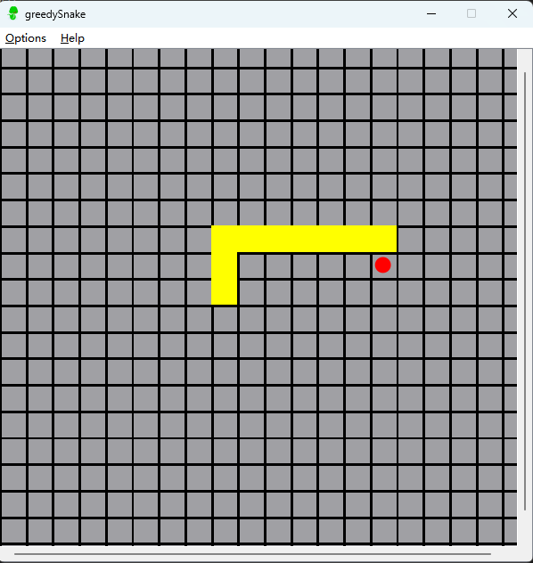

# cppGreedySnake
## Introduction
- This is a snake game based on ```Qt```. You can download and build&run it directly without other configurations.
- 这是一款基于 ```Qt``` 开发的贪吃蛇游戏。可以在Qt creator中直接编译运行，无需额外配置。
## Environment
- *Qt4* or new.
- *QtCreator/vscode + minGW.*
- *Linux/windows10/11.*
## icon

## References
[Reference sources.](https://github.com/devbean/snake-game) If there is an infringement or legal issue, please contact me to delete.
## Usage
1. ```build&run.```
2. Use ```↑ ↓ ← →``` to control the sanke to move in different directions.<br>
Use ```Ctrl+N``` to create a new game interface.<br>
Use ```Ctrl+Q``` to quit the game.<br>
Use ```Ctrl+H``` to find help.<br>
## Interface

## Contact
[Contact me.](neganthomas2024@gmail.com)
